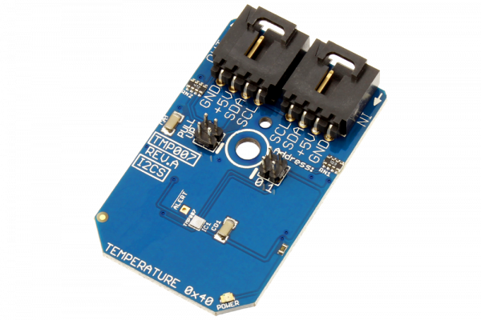

# TMP007

The Texas Instruments TMP007 is a fully-integrated micro electro-mechanical system (MEMS) thermopile sensor that measures the temperature of an object without direct contact. The integrated thermopile absorbs the infrared energy emitted from the object in the sensor’s field of view. The Infrared thermopile sensor is specified to operate from –40°C to +125°C. 
This Device is available from www.ncd.io 

[SKU: TMP007_I2CS]

(https://store.ncd.io/product/tmp007-infrared-thermopile-sensor-with-integrated-math-engine-i2c-mini-module/)
This Sample code can be used with Arduino.

Hardware needed to interface TMP007 sensor with Arduino

1. <a href="https://store.ncd.io/product/i2c-shield-for-arduino-nano/">Arduino Nano</a>

2. <a href="https://store.ncd.io/product/i2c-shield-for-arduino-micro-with-i2c-expansion-port/">Arduino Micro</a>

3. <a href="https://store.ncd.io/product/i2c-shield-for-arduino-uno/">Arduino uno</a>

4. <a href="https://store.ncd.io/product/dual-i2c-shield-for-arduino-due-with-modular-communications-interface/">Arduino Due</a>

5. <a href="https://store.ncd.io/product/tmp007-infrared-thermopile-sensor-with-integrated-math-engine-i2c-mini-module/">TMP007 Infrared Thermopile Sensor</a>

6. <a href="https://store.ncd.io/product/i%C2%B2c-cable/">I2C Cable</a>

TMP007:

The Texas Instruments TMP007 is a fully-integrated micro electro-mechanical system (MEMS) thermopile sensor that measures the temperature of an object without direct contact. The integrated thermopile absorbs the infrared energy emitted from the object in the sensor’s field of view. The Infrared thermopile sensor is specified to operate from –40°C to +125°C. 

Applications:

• Temperature Measurement- Laptop and Tablet Cases, Batteries,Heat Sinks,Skin,Laser Printers.

How to Use the TMP007 Arduino Library

The TMP007 has a number of settings, which can be configured based on user requirements.
          
1.Address calling:The following command is used to call the address of TMP007 sensor to begin the transmission.

             tmd.setATime(ATIME_609MS);           // Cycles: 256, Time: 609 ms Max Count: 65535
            
2.Temperature measurement:The following command is used to measure the temperature.

             TDieC = tmp.Measure_DieTemp();
            
